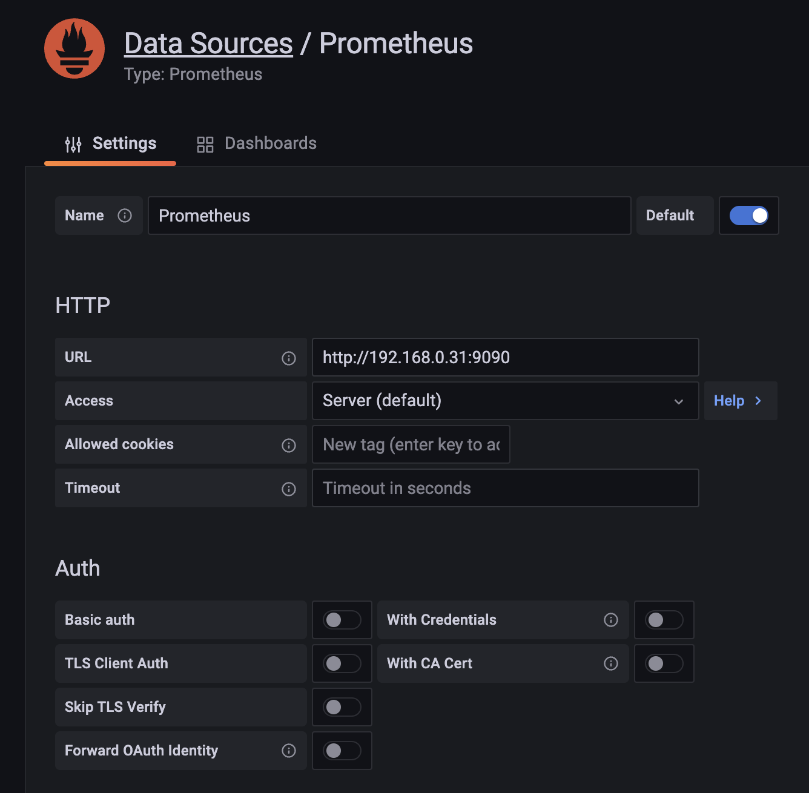

# healthy-cameras

---

[](https://twitter.com/intent/tweet?text=%20Checkout%20this%20%40github%20repo%20by%20%40joaofse%20%F0%9F%91%A8%F0%9F%8F%BD%E2%80%8D%F0%9F%92%BB%3A%20https%3A//github.com/jesperancinha/healthy-cameras)
[](https://github.com/jesperancinha/healthy-cameras)

[](https://www.apache.org/licenses/LICENSE-2.0)

[](https://github.com/jesperancinha/healthy-cameras/actions/workflows/healthy-camera.yml)
[](https://ci.appveyor.com/project/jesperancinha/healthy-cameras)

[](https://www.codacy.com/gh/jesperancinha/healthy-cameras/dashboard?utm_source=github.com&amp;utm_medium=referral&amp;utm_content=jesperancinha/healthy-cameras&amp;utm_campaign=Badge_Grade)
[](https://bettercodehub.com/results/jesperancinha/healthy-cameras)
[](https://snyk.io/test/github/jesperancinha/healthy-cameras)

[](#)
[](#)
[](#)

---

🚧🚧🚧🚧🚧🚧🚧🚧🚧🚧🚧🚧🚧 !!! [Under construction...](https://github.com/jesperancinha/project-signer/blob/master/project-signer-templates/UnderConstruction.md) !!! 🚧🚧🚧🚧🚧🚧🚧🚧🚧🚧

Demo on Kong in a system where several cameras watch over a building, and we need to constantly monitor their status

## How to run

##### Simple run

```shell
docker-compose up -d
```

or

```shell
make dcup
```

-   [Prometheus on port 9090 - http://localhost:9090/](http://localhost:9090/)
-   [Grafana on port 3000 - http://localhost:3000/](http://localhost:3000/)
-   [Prometheus' metrics raw in the Camera Service on port 8080 - http://localhost:8080/actuator/prometheus](http://localhost:8080/actuator/prometheus)
-   [Prometheus targets on port 9090 - http://localhost:9090/targets?search=](http://localhost:9090/targets?search=)
-   [Camera Welcome Message for camera 1 - http://localhost:8000/camera-1-service](http://localhost:8000/camera-1-service)
-   [Metrics in Kong - http://localhost:8001/metrics](http://localhost:8001/metrics)

##### Configuring Grafana

[]()

`http://192.168.0.31:9090
`
## References

#### Online

-   [Defining custom metrics in a Spring Boot application using Micrometer](https://autsoft.net/defining-custom-metrics-in-a-spring-boot-application-using-micrometer/)
-   [Kong Blog Posts](https://github.com/danielkocot/kong-blogposts)
-   [Kong API Gateway – Observability with Prometheus, Grafana and OpsGenie by Daniel Kocot](https://blog.codecentric.de/en/2019/12/kong-api-gateway-observability-with-prometheus-grafana-and-opsgenie/)
-   [Defining custom metrics in a Spring Boot application using Micrometer](https://autsoft.net/defining-custom-metrics-in-a-spring-boot-application-using-micrometer/)
-   [Spring Boot app metrics - with Prometheus and Micrometer](https://www.tutorialworks.com/spring-boot-prometheus-micrometer/#adding-a-custom-metric)
-   [https://github.com/prometheus/statsd_exporter](https://github.com/prometheus/statsd_exporter)
-   [StatsD: What Is It and How To Monitor It](https://www.metricfire.com/blog/statsd-what-is-it-and-how-to-monitor-it/)
-   [Kong Gateway](https://docs.konghq.com/gateway/)
-   [Kong Vitals](https://docs.konghq.com/gateway/2.8.x/vitals/)
-   [Kong Plugin Hub](https://docs.konghq.com/hub/)
-   [Kong Lua Rules](https://docs.konghq.com/hub/kong-inc/bot-detection/)

#### Videos

<div align="center"> 
      <a title="Custom Metrics with Prometheus by Stack Doctor" href="https://www.youtube.com/watch?v=XToKHYXSUyc">
     
      </a>
     <a title="Getting Started with Kong Ingress Controller for Kubernetes" href="https://www.youtube.com/watch?v=hrYqGXU-a6E">
     
      </a>
</div>

## About me 👨🏽‍💻🚀🏳️‍🌈

[](http://joaofilipesabinoesperancinha.nl)
[](https://medium.com/@jofisaes)
[](https://www.buymeacoffee.com/jesperancinha)
[](https://www.credly.com/users/joao-esperancinha)
[](https://joaofilipesabinoesperancinha.nl/)
[](https://play.google.com/store/apps/developer?id=Joao+Filipe+Sabino+Esperancinha)
[](https://search.maven.org/search?q=org.jesperancinha)
[](https://hub.docker.com/u/jesperancinha)
[](https://stackoverflow.com/users/3702839/joao-esperancinha)
[](https://www.reddit.com/user/jesperancinha/)
[](https://dev.to/jofisaes)
[](https://hackernoon.com/@jesperancinha)
[](https://www.codeproject.com/Members/jesperancinha)
[](https://github.com/jesperancinha)
[](https://bitbucket.org/jesperancinha)
[](https://gitlab.com/jesperancinha)
[](https://www.coursera.org/user/da3ff90299fa9297e283ee8e65364ffb)
[](https://www.freecodecamp.org/jofisaes)
[](https://www.hackerrank.com/jofisaes)
[](https://leetcode.com/jofisaes)
[](https://coderbyte.com/profile/jesperancinha)
[](https://www.codewars.com/users/jesperancinha)
[](https://codepen.io/jesperancinha)
[](https://www.hackerearth.com/@jofisaes)
[](https://www.khanacademy.org/profile/jofisaes)
[](https://twitter.com/joaofse)
[](https://news.ycombinator.com/user?id=jesperancinha)
[](https://www.infoq.com/profile/Joao-Esperancinha.2/)
[](https://www.linkedin.com/in/joaoesperancinha/)
[](https://www.xing.com/profile/Joao_Esperancinha/cv)
[](https://jofisaes.tumblr.com/)
[](https://nl.pinterest.com/jesperancinha/)
[](https://nl.quora.com/profile/Jo%C3%A3o-Esperancinha)
[](https://www.credly.com/badges/762fa7a4-9cf4-417d-bd29-7e072d74cdb7)
[](https://www.credly.com/badges/27a14e06-f591-4105-91ca-8c3215ef39a2)
[](https://www.credly.com/badges/87609d8e-27c5-45c9-9e42-60a5e9283280)
[](https://www.credly.com/badges/ad1f4abe-3dfa-4a8c-b3c7-bae4669ad8ce)
[](https://cancanit.com/certified/1462/)
[](https://graphacademy.neo4j.com/certificates/c279afd7c3988bd727f8b3acb44b87f7504f940aac952495ff827dbfcac024fb.pdf)
[](https://www.credly.com/badges/8d27e38c-869d-4815-8df3-13762c642d64)
[](https://github.com/JEsperancinhaOrg)
[](https://joaofilipesabinoesperancinha.nl/badges)
[](https://github.com/jesperancinha/project-signer/blob/master/project-signer-quality/Build.md)
