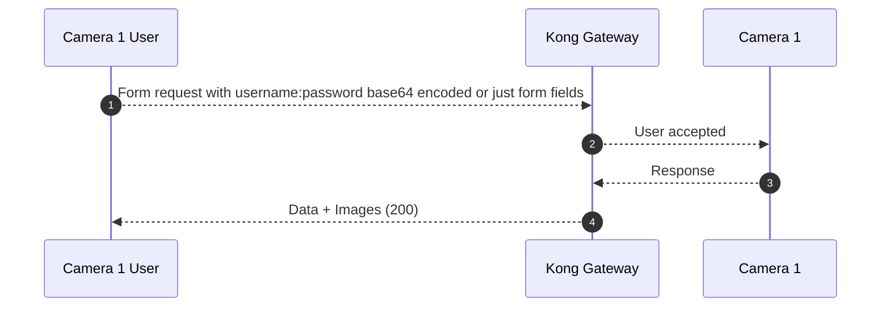
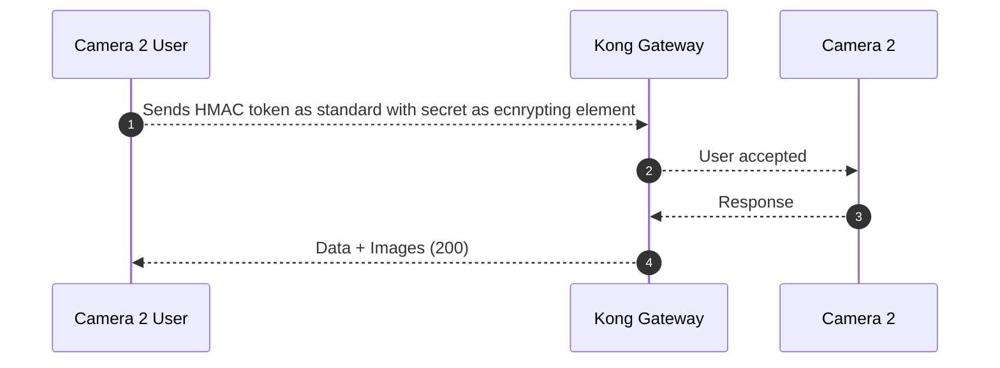
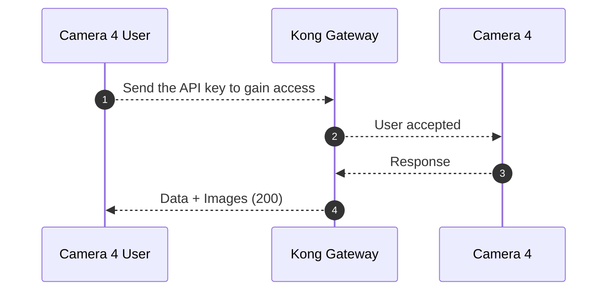
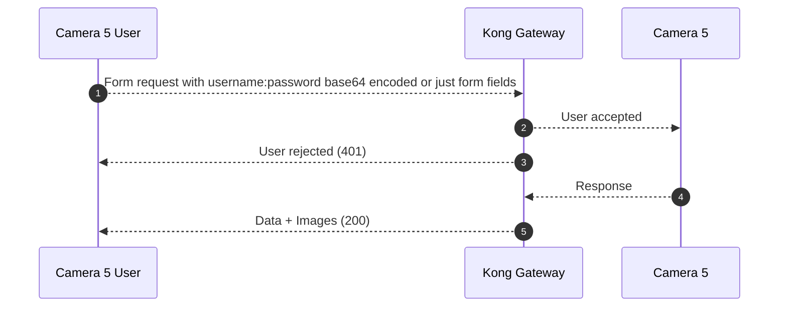
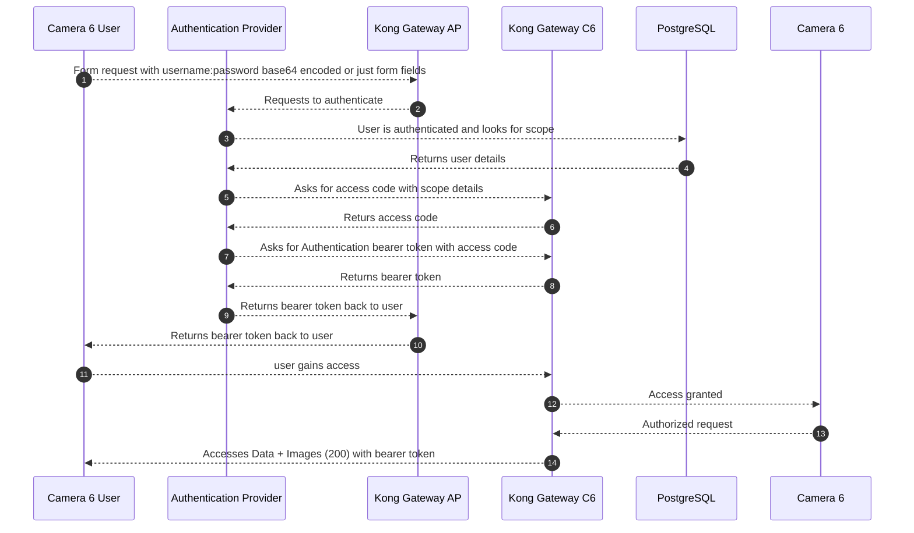

# Authentication methods

## Basic Auth

```mermaid
sequenceDiagram
    participant Camera 1 User
    participant Kong Gateway
    participant Camera 1
    autonumber

    links Kong Gateway:{"Home": "https://konghq.com/", "StatsD": "https://docs.konghq.com/hub/kong-inc/statsd/", "Basic Auth": "https://docs.konghq.com/hub/kong-inc/basic-auth/"}
    links Camera 1:{"Spring Boot": "https://spring.io/projects/spring-boot", "Spring Reactive": "https://docs.spring.io/spring-framework/docs/current/reference/html/web-reactive.html"} 
    Camera 1 User-->>Kong Gateway: Form request with username:password base64 encoded or just form fields
    Kong Gateway-->>Camera 1: User accepted
    Camera 1-->>Kong Gateway: Response
    Kong Gateway-->>Camera 1 User: Data + Images (200)
```

## HMAC Authentication

```mermaid
sequenceDiagram
    participant Camera 2 User
    participant Kong Gateway
    participant Camera 2
    autonumber
 
    links Kong Gateway:{"Home": "https://konghq.com/", "StatsD": "https://docs.konghq.com/hub/kong-inc/statsd/", "HMAC":"https://docs.konghq.com/hub/kong-inc/hmac-auth/"}
    links Camera 2:{"Spring Boot": "https://spring.io/projects/spring-boot", "Spring Reactive": "https://docs.spring.io/spring-framework/docs/current/reference/html/web-reactive.html"} 
    
    Camera 2 User-->>Kong Gateway: Sends HMAC token as standard with secret as ecnrypting element
    Kong Gateway-->>Camera 2: User accepted
    Camera 2-->>Kong Gateway: Response
    Kong Gateway-->>Camera 2 User: Data + Images (200)
```

## JWT Authentication

```mermaid
sequenceDiagram
    participant Camera 3 User
    participant Kong Gateway
    participant Camera 3
    autonumber

    links Kong Gateway:{"Home": "https://konghq.com/", "StatsD": "https://docs.konghq.com/hub/kong-inc/statsd/", "JWT": "https://docs.konghq.com/hub/kong-inc/jwt/"}
    links Camera 3:{"Spring Boot": "https://spring.io/projects/spring-boot", "Spring Reactive": "https://docs.spring.io/spring-framework/docs/current/reference/html/web-reactive.html"} 
    
    Camera 3 User-->>Kong Gateway: Sends JWT pre-created token with previously signed for validation
    Kong Gateway-->>Camera 3: User accepted
    Camera 3-->>Kong Gateway: Response
    Kong Gateway-->>Camera 3 User: Data + Images (200)
```

## API Token Authentication

```mermaid
sequenceDiagram
    participant Camera 4 User
    participant Kong Gateway
    participant Camera 4
    autonumber

    links Kong Gateway:{"Home": "https://konghq.com/", "StatsD": "https://docs.konghq.com/hub/kong-inc/statsd/", "Key": "https://docs.konghq.com/hub/kong-inc/key-auth/"}
    links Camera 4:{"Spring Boot": "https://spring.io/projects/spring-boot", "Spring Reactive": "https://docs.spring.io/spring-framework/docs/current/reference/html/web-reactive.html"} 
    
    Camera 4 User-->>Kong Gateway: Send the API key to gain access
    Kong Gateway-->>Camera 4: User accepted
    Camera 4-->>Kong Gateway: Response
    Kong Gateway-->>Camera 4 User: Data + Images (200)
```

## LDAP Authentication

```mermaid
sequenceDiagram
    participant Camera 5 User
    participant Kong Gateway
    participant Camera 5
    autonumber

    links Kong Gateway:{"Home": "https://konghq.com/", "StatsD": "https://docs.konghq.com/hub/kong-inc/statsd/", "Key": "https://docs.konghq.com/hub/kong-inc/key-auth/"}
    links Camera 5:{"Spring Boot": "https://spring.io/projects/spring-boot", "Spring Reactive": "https://docs.spring.io/spring-framework/docs/current/reference/html/web-reactive.html"} 
    
    Camera 5 User-->>Kong Gateway: Form request with username:password base64 encoded or just form fields
    Kong Gateway-->>Camera 5: User accepted
    Kong Gateway-->>Camera 5 User: User rejected (401)
    Camera 5-->>Kong Gateway: Response
    Kong Gateway-->>Camera 5 User: Data + Images (200)
```

## OAuth Authentication

```mermaid
sequenceDiagram
    participant Camera 6 User
    participant Authentication Provider
    participant Kong Gateway AP 
    participant Kong Gateway C6
    participant PostgreSQL
    participant Camera 6
    autonumber

    links Kong Gateway AP:{"Home": "https://konghq.com/"}
    links Kong Gateway C6:{"Home": "https://konghq.com/", "StatsD": "https://docs.konghq.com/hub/kong-inc/statsd/", "OAuth2": "https://docs.konghq.com/hub/kong-inc/oauth2/"}
    links Camera 6:{"Spring Boot": "https://spring.io/projects/spring-boot", "Spring Reactive": "https://docs.spring.io/spring-framework/docs/current/reference/html/web-reactive.html"} 
    links PostgreSQL:{"PostgreSQL": "https://www.postgresql.org/"} 
    
    Camera 6 User-->>Kong Gateway AP: Form request with username:password base64 encoded or just form fields
    Kong Gateway AP-->>Authentication Provider: Requests to authenticate
    Authentication Provider-->>PostgreSQL: User is authenticated and looks for scope
    PostgreSQL-->>Authentication Provider: Returns user details
    Authentication Provider-->>Kong Gateway C6: Asks for access code with scope details
    Kong Gateway C6-->> Authentication Provider: Returs access code
    Authentication Provider-->>Kong Gateway C6: Asks for Authentication bearer token with access code
    Kong Gateway C6-->>Authentication Provider: Returns bearer token
    Authentication Provider-->>Kong Gateway AP: Returns bearer token back to user
    Kong Gateway AP-->>Camera 6 User: Returns bearer token back to user
    Camera 6 User-->>Kong Gateway C6: user gains access
    Kong Gateway C6-->>Camera 6: Access granted
    Camera 6-->>Kong Gateway C6: Authorized request
    Kong Gateway C6-->>Camera 6 User: Accesses Data + Images (200) with bearer token
```

