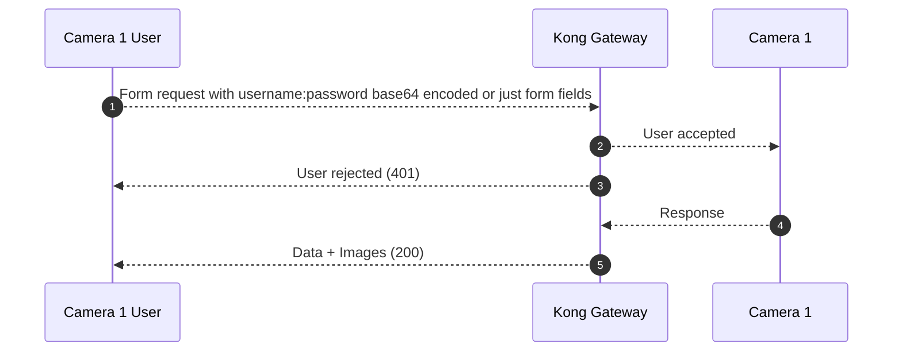
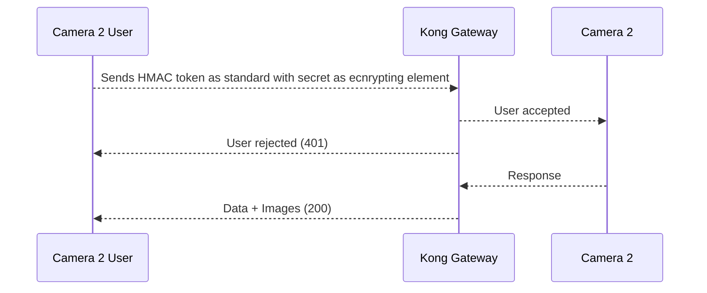

# Authentication methods

## Basic Auth

```mermaid
sequenceDiagram
    participant Camera 1 User
    participant Kong Gateway
    participant Camera 1
    autonumber

    links Kong Gateway:{"Home": "https://konghq.com/", "StatsD": "https://docs.konghq.com/hub/kong-inc/statsd/"}
    links Camera 1:{"Spring Boot": "https://spring.io/projects/spring-boot", "Spring Reactive": "https://docs.spring.io/spring-framework/docs/current/reference/html/web-reactive.html"} 
    Camera 1 User-->>Kong Gateway: Form request with username:password base64 encoded or just form fields
    Kong Gateway-->>Camera 1: User accepted
    Kong Gateway-->>Camera 1 User: User rejected (401)
    Camera 1-->>Kong Gateway: Response
    Kong Gateway-->>Camera 1 User: Data + Images (200)
```

## HMAC Authentication

```mermaid
sequenceDiagram
    participant Camera 2 User
    participant Kong Gateway
    participant Camera 2
    
    links Kong Gateway:{"Home": "https://konghq.com/", "StatsD": "https://docs.konghq.com/hub/kong-inc/statsd/"}
    links Camera 2:{"Spring Boot": "https://spring.io/projects/spring-boot", "Spring Reactive": "https://docs.spring.io/spring-framework/docs/current/reference/html/web-reactive.html"} 
    
    Camera 2 User-->>Kong Gateway: Sends HMAC token as standard with secret as ecnrypting element
    Kong Gateway-->>Camera 2: User accepted
    Kong Gateway-->>Camera 2 User: User rejected (401)
    Camera 2-->>Kong Gateway: Response
    Kong Gateway-->>Camera 2 User: Data + Images (200)
```

